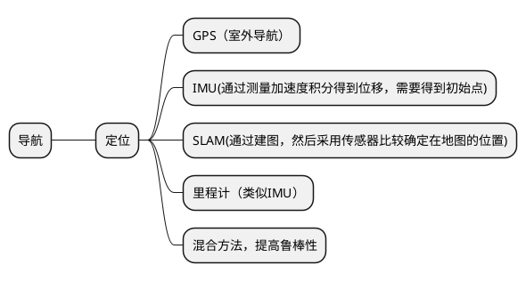
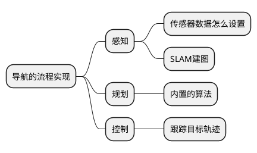
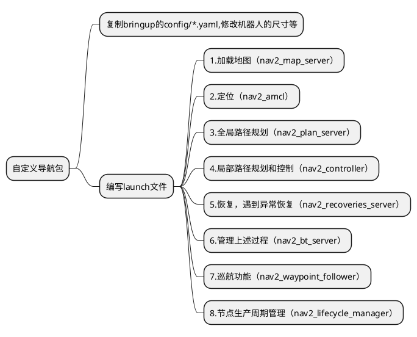
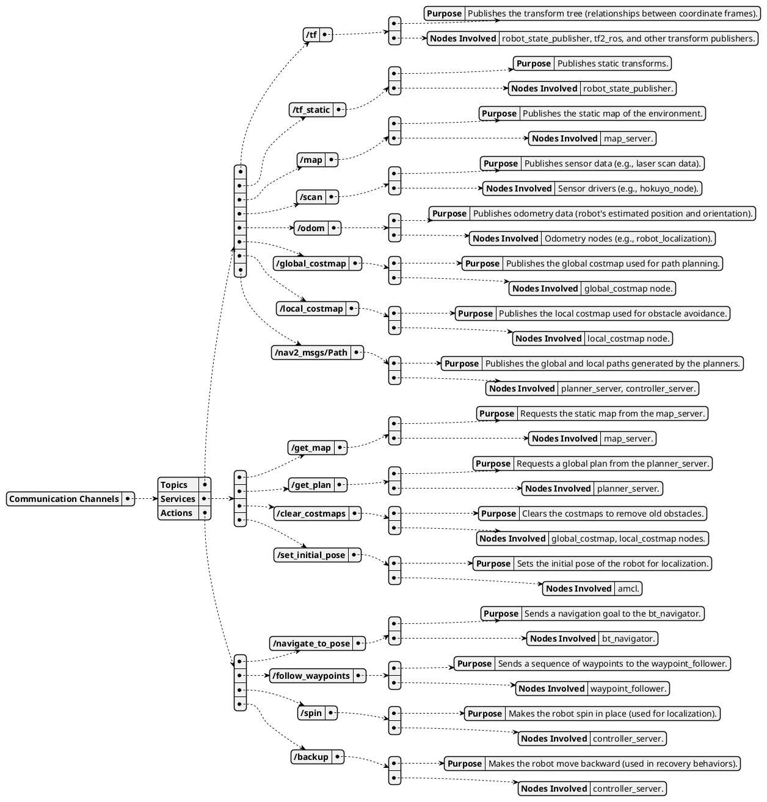
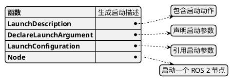

[TOC]
# 项目目标
移动机器人自主导航系统
验收标准（流程和大致项目跑通+可以改用自己导航的算法）TurtleBot3机器人了解，对应的关节和连杆，导航需要的传感器怎么设置 
1.	内置导航nav2实现全局导航，可以采用内置算法，导航的流程实现，可以采用开源的项目，流程一定要会。
2.	比如流程里有建图，需要建图
3. 里面对应的功能，里面的话题，服务，动作分别是什么作用。

# 项目实战
参考开源项目： [nav2](https://github.com/fishros/fishbot)
编译的时候记得删除navigation，避免编译时间过长。
[文档参考](https://fishros.com/d2lros2/#/humble/chapt10/)

## 步骤

```bash
git clone <address>
cd fishbot
colcon build
```
### 在RVIZ中显示机器人模型
#### 编写代码思路
1.创建以来python得到，作为机器人表述包，有world,urdf,launch文件，在setup中加入下述，方便编译install生成文件，方便launch文件查找。
```python
        (os.path.join('share', package_name, 'launch'), glob('launch/*.launch.py')),
        (os.path.join('share', package_name, 'urdf'), glob('urdf/**')),
        (os.path.join('share', package_name, 'world'), glob('world/**')),
```
2.urdf 下放机器人的urdf,和gezebo的urdf文件,添加gazebo标签的可以添加物理属性，和外观，便于gezabo仿真，没有也能打开

```bash
source install/setup.bash
ros2 launch fishbot_description display_rviz2.launch.py
```

3.world文件获取，直接打开gazebo里面绘图，然后导出为world文件，[资料](https://fishros.com/d2lros2/#/humble/chapt9/get_started/7.Gazebo%E4%BB%BF%E7%9C%9F%E7%8E%AF%E5%A2%83%E6%90%AD%E5%BB%BA)
4.然后根据需要实现的功能编写launch文件

#### 仿真
```bash
source install/setup.bash
ros2 launch fishbot_description gazebo.launch.py
```

### 建图
#### 编写思路
1.创建基于ament_cmake的包（默认是ament_camke），目标是得到map文件夹里的文件。创建launch,rviz,config，然后对应的makelist添加。
```makefile
install(
  DIRECTORY config launch rviz
  DESTINATION share/${PROJECT_NAME}
)
```
2.采用的工具是cartograper工具，首先配置config，配置文件是固定的，主要目的是确定从哪些话题里面构建地图（包含各种传感器的话题）
3.然后编写启动文件，来启动建图工具和rviz
4.建图的原理是：gazebo仿真环境，因为我们的建图程序依赖于Gazebo提供雷达和里程计等数据
所以需要先启动gazebo
5.然后启动建图工具的launch文件。
6.保存地图
```bash
# 先将地图保存到src/fishbot_cartographer/map目录下
cd src/fishbot_cartographer/ && mkdir map && cd map
ros2 run nav2_map_server map_saver_cli -t map -f fishbot_map
```
#### 启动
```bash
source install/setup.bash
ros2 launch fishbot_cartographer cartographer.launch.py
```


### Nav2
#### 编写思路
1.创建基于cmake_ament的导航包，不需要编写源码，主要是提供导航配置文件和地图。创建的文件夹都需要在cmakelist.txt添加
```cmake
install(
  DIRECTORY launch  config param maps
  DESTINATION share/${PROJECT_NAME}
)
```
2.加载地图，将上述地图复制到maps文件夹下
3..在param文件夹添加yaml配置文件，可以网上下载，修改成自己机器人对应的尺寸和算法，[配置指南](https://fishros.com/d2lros2/#/humble/chapt11/get_started/2.%E4%B8%BAFishBot%E9%85%8D%E7%BD%AENav2?id=_12-%e6%b7%bb%e5%8a%a0maps%e6%96%87%e4%bb%b6%e5%a4%b9)
4.添加导航依赖，package.xml需要
```xml
  <exec_depend>nav2_bringup</exec_depend>
  ```
5.编写Launch文件。指定地图和导航参数配置yaml文件，然后启动rviz来显示传感器建图。
6.后续可以不需要图形化操作，采用api来实现起点和终点的位姿设置。
#### 启动
```bash
source install/setup.bash
ros2 launch fishbot_navigation2 navigation2.launch.py use_sim_time:=True
```
## 问题汇总
1. gazebo不显示机器人
```bash
#缺少 lxml包，
pip install lxml
```
2. share 文件下找不到文件,setup.py或cmakelist.txt添加文件路径
3. 
# 理论基础
## 机器人介绍
优势：开源的、应用广，资料多。

### 介绍
TurtleBot3 是一款非常受欢迎的移动机器人平台，广泛应用于教育、研究和开发领域。它有多个型号，包括 Burger、Waffle 和 Waffle Pi。以下是关于 TurtleBot3 的详细描述，包括传感器、车轮、外形等关键特性：
- **传感器**：激光雷达、IMU 和可选摄像头。
- **车轮**：差分驱动系统，配备两个驱动轮。
- **外形**：Burger 为圆形底座，Waffle/Waffle Pi 为矩形底座。
- **控制器**：树莓派 3 Model B 或 B+。
- **电池**：锂离子电池，续航时间适中。
- **扩展性**：多个接口用于额外硬件。
- **开源**：硬件和软件完全开源。
- **ROS 兼容性**：非常适合基于 ROS 的项目。

这些特性使 TurtleBot3 适用于从教育项目到机器人研究的广泛应用场景。
里程计是什么，对应的数据类型，主要是一个传感器，获取物体的位姿，应用有可视化（rviz）、方便导航和定位。数据一般都是通过话题来发布
## Nav2包框架介绍


# Nav2 tutorial
1. 基本的导航案例，给定初始位置，以及目标位置，机器人可以过去
```bash
export TURTLEBOT3_MODEL=waffle  # Iron and older only with Gazebo Classic
export GAZEBO_MODEL_PATH=$GAZEBO_MODEL_PATH:/opt/ros/humble/share/turtlebot3_gazebo/models # Iron and older only with Gazebo Classic
ros2 launch nav2_bringup tb3_simulation_launch.py headless:=False
```
2. 学习navigation2导航包源码怎么入手，先看什么文件比较好，主要是想快速学习怎么使用这个导航包完成自己的任务。是先看param里面得yaml文件，了解怎么配置吗输入数据（话题）: 服务或动作: 输出数据（话题）
## 导航中的关键概念



### Nav2 bringup工具包
#### 文件结构
```plaint
├── CHANGELOG.rst
├── CMakeLists.txt
├── launch
│   ├── bringup_launch.py
│   ├── cloned_multi_tb3_simulation_launch.py
│   ├── localization_launch.py
│   ├── navigation_launch.py
│   ├── rviz_launch.py
│   ├── slam_launch.py
│   ├── tb3_simulation_launch.py
│   └── unique_multi_tb3_simulation_launch.py
├── maps
│   ├── turtlebot3_world.pgm
│   └── turtlebot3_world.yaml
├── package.xml
├── params
│   ├── nav2_multirobot_params_1.yaml
│   ├── nav2_multirobot_params_2.yaml
│   ├── nav2_multirobot_params_all.yaml
│   └── nav2_params.yaml
├── README.md
├── rviz
│   ├── nav2_default_view.rviz
│   └── nav2_namespaced_view.rviz
├── urdf
│   └── turtlebot3_waffle.urdf
└── worlds
    ├── waffle.model
    └── world_only.model
```
## 自主移动机器人导航框架


## 涉及到的核心知识
1. 机器人替换。基于上述现成的，替换成自己机器人，首先将urdf替换为自己的移动机器人，确保有base_link。符合一些标准的坐标系要有，map,odom.
还有就是params里面的物体的半径需要和urdf对应起来，这个是机器人避障算法的关键参数。可以找开源的常用机器人。[open source mobile robot urdf](https://github.com/ali-pahlevani/Mobile_Robot_URDF_Maker)
2. 地图替换类似。地图生成采用。地图的获取可以采用，slam-toolbox来实现扫图。得到地图数据之后可以采用下述方法保存文件。
```bash
sudo apt install ros-$ROS_DISTRO-nav2-map-server
ros2 run nav2_map_server map_saver_cli --help
```
得到ngm文件和yaml文件
3. 修改各种算法，导航算法、控制算法..内置的算法。通过修改condig/nav2_params.yaml实现，里面有规划的控制的插件（插件是实现某一任务的额外的插件）。实现各种算法都已网上查找插件实现。
```yaml
global_planner:
  plugin: "nav2_navfn_planner/NavfnPlanner"
```
4. 以及自己编写的算法可以嵌入。
可以，通过编写一个插件实现。插件本质上是一个功能包，相当于写一个功能包，采用c++/python都可以实现。nav2_navfn_planner/NavfnPlanner，，上述的前半部分是包名，后半部分是一个类，继承标准的导航类：nav2_core.global_planner.GlobalPlanner。还需要修改一些依赖，来声明这个包是个插件，具体的插件创建可以查看官网。
5. 采用python api来实现设置目标点，和加入视觉算法来自主得到目标点。[python接口学习](https://docs.nav2.org/commander_api/index.html),,按照对应的接口熟悉各函数的应用。
6. 导航中的几个模块分别对应bringup里面的哪些函数，还是nav2中的哪些函数，bringup是基于nav2实现的吗、
bringup是一个例子告诉如何使用nav2 包的，里面用到nav2包的有yaml文件和launch文件。

7. 查看Bringup运行时有哪些通讯起作用。里面对应的功能，里面的话题，服务，动作分别是什么作用。

8. 怎么编写一个launch文件,函数使用
