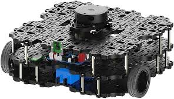

[TOC]
移动机器人自主导航系统（周六）
验收标准（流程和大致项目跑通+可以改用自己导航的算法）TurtleBot3机器人了解，对应的关节和连杆，导航需要的传感器怎么设置 
1.	内置导航nav2实现全局导航，可以采用内置算法，导航的流程实现，可以采用开源的项目，流程一定要会。
2.	比如流程里有建图，需要建图
3. 里面对应的功能，里面的话题，服务，动作分别是什么作用。

硬性标准
1.	Git项目一个，机械臂抓取
2.	详细的readme指导书

# turtlebot3
优势：开源的、应用广，资料多。

## 介绍
TurtleBot3 是一款非常受欢迎的移动机器人平台，广泛应用于教育、研究和开发领域。它有多个型号，包括 Burger、Waffle 和 Waffle Pi。以下是关于 TurtleBot3 的详细描述，包括传感器、车轮、外形等关键特性：
- **传感器**：激光雷达、IMU 和可选摄像头。
- **车轮**：差分驱动系统，配备两个驱动轮。
- **外形**：Burger 为圆形底座，Waffle/Waffle Pi 为矩形底座。
- **控制器**：树莓派 3 Model B 或 B+。
- **电池**：锂离子电池，续航时间适中。
- **扩展性**：多个接口用于额外硬件。
- **开源**：硬件和软件完全开源。
- **ROS 兼容性**：非常适合基于 ROS 的项目。

这些特性使 TurtleBot3 适用于从教育项目到机器人研究的广泛应用场景。
里程计是什么，对应的数据类型，主要是一个传感器，获取物体的位姿，应用有可视化（rviz）、方便导航和定位。数据一般都是通过话题来发布
# Nav2包框架


# 自主移动机器人导航


# Nav2 tutorial
1. 基本的导航案例，给定初始位置，以及目标位置，机器人可以过去
```bash
ros2 launch nav2_bringup tb3_simulation_launch.py headless:=False
```
2. 学习navigation2导航包源码怎么入手，先看什么文件比较好，主要是想快速学习怎么使用这个导航包完成自己的任务。是先看param里面得yaml文件，了解怎么配置吗

# Nav2 bringup工具包
## 文件结构
```plaint
├── CHANGELOG.rst
├── CMakeLists.txt
├── launch
│   ├── bringup_launch.py
│   ├── cloned_multi_tb3_simulation_launch.py
│   ├── localization_launch.py
│   ├── navigation_launch.py
│   ├── rviz_launch.py
│   ├── slam_launch.py
│   ├── tb3_simulation_launch.py
│   └── unique_multi_tb3_simulation_launch.py
├── maps
│   ├── turtlebot3_world.pgm
│   └── turtlebot3_world.yaml
├── package.xml
├── params
│   ├── nav2_multirobot_params_1.yaml
│   ├── nav2_multirobot_params_2.yaml
│   ├── nav2_multirobot_params_all.yaml
│   └── nav2_params.yaml
├── README.md
├── rviz
│   ├── nav2_default_view.rviz
│   └── nav2_namespaced_view.rviz
├── urdf
│   └── turtlebot3_waffle.urdf
└── worlds
    ├── waffle.model
    └── world_only.model
```
## 基于nav2_bringup包开发自己的（todo）
1. 机器人替换。基于上述现成的，替换成自己机器人，首先将urdf替换为自己的移动机器人，确保有base_link。符合一些标准的坐标系要有，map,odom.
还有就是params里面的物体的半径需要和urdf对应起来，这个是机器人避障算法的关键参数。可以找开源的常用机器人。[open source mobile robot urdf](https://github.com/ali-pahlevani/Mobile_Robot_URDF_Maker)
2. 地图替换类似。地图生成采用。地图的获取可以采用，slam-tool来实现扫图。得到地图数据之后可以采用下述方法保存文件。
```bash
sudo apt install ros-$ROS_DISTRO-nav2-map-server
ros2 run nav2_map_server map_saver_cli --help
```
得到ngm文件和yaml文件
3. 修改各种算法，导航算法、控制算法..内置的算法，
4. 以及自己编写的算法可以嵌入。
5. 采用python api来实现设置目标点，和加入视觉算法来自主得到目标点。[python接口学习](https://docs.nav2.org/commander_api/index.html),,按照对应的接口熟悉各函数的应用。
6. 导航中的几个模块分别对应bringup里面的哪些函数，还是nav2中的哪些函数，bringup是基于nav2实现的吗
7. 查看Bringup运行时有哪些通讯起作用。里面对应的功能，里面的话题，服务，动作分别是什么作用。